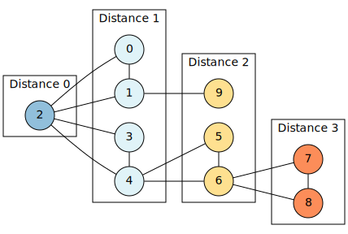

# Final Project Report
## Oscar Sebastián Sánchez Morales
### BUID: U51716578  
<br>

## Context  

This is my report for the submisson of the final project for the class **DS210: Programming for Data Science.**  

This project was developed in [**Rust**](https://www.rust-lang.org/). And had as objective to analyze a graph and come up with interesting features about it. 

I first choosen [this](https://law.di.unimi.it/webdata/hollywood-2011/) graph. It's a social graph of movie actors, where vertices are actors, and two actors are joined by an edge whenever they appeared in a movie together. This was interesting to me because I really like movies, and although the data is private and all names are encrypted, I thought that a lot of analysis could be done.  

Nevertheless, as much as I tried, I couldn't download the graph as a .txt file, so because of that I had to choose another graph to work with. After discussing with my professor, we came to an agreement, and the dataset that I used for this project is [the following](https://snap.stanford.edu/data/ego-Gplus.html). This is a social graph of the circles of Google+, the data was collected from users who had manually shared their circles using the 'share circle' feature.  

The dataset is a .txt file with **30,494,866** lines, where every line is composed of a connection between two nodes. And the question that I answered is the mean distance between all nodes of the graph.  
<br>

## Steps

### Create graph  

The first thing that needed to be done was read the file. To do this, i implemented a function that reads the file and converts it to a graph adjacency list representation.    

The first challenge that arose was that in the .txt file, all values were encriped as a string of 21 characters that were numbers. For example, the first line of the dataset is:  

<p align="center"> <b> 115221898088173734174 107026299993226528916 </b> </p>

So, in order to transform this entire file into a graph representation with an adjacency list, I first needed to transform the values of the nodes into something more computable.  

What i did is that when reading the dataset from the .txt file, I created a Hashmap, where the key is the enormous "number" readed from the file, and the value is an integer that started from zero. While the file is being read, I check for the key in the hasmap, if the key is in the hashmap nothing happens, but if the key is not in the hasmap, it's inserted into it with a value corresponded to the integer, and this integer is incremented by one. After that, I just get the values from the keys on the hasmap that I need and push them into the list of edges. 


```
//If the hashmap doesn't contains x, insert x into the hasmap
if !pairs.contains_key(&x) {
    pairs.insert(x, pos);
    pos = pos + 1;
}

//If the hashmap doesn't contains y, insert y into the hasmap
if !pairs.contains_key(&y) {
    pairs.insert(y, pos);
    pos = pos + 1;
}

//Get the integer value of the x and y value 
let temp_x = *pairs.get(&x).unwrap();
let temp_y =  *pairs.get(&y).unwrap();

/Push those values into the edges
edges.push((temp_x, temp_y));
```  
<br>  

After doing this, I just pushed the values from the edges to the adjacency list and returned the graph.  

``` 
for (v,w) in edges.iter() {

    //If the flag is true, just push v -> w (directed).
    if flag {
        graph_list[*v].push(*w);
    }

    //Else push v <-> w (undirected).
    else {
        graph_list[*v].push(*w);
        graph_list[*w].push(*v);
    }
}

//Return the graph
Graph { 
    n: pairs.len() as usize, 
    adjacency_list: graph_list, 
}
```
<br>

### Calculate the distance

Once the graph is created, we can start to play with it. As I mentioned earlier, the question that I was trying to answer was the mean distance between all nodes in the graph. To do this, I implemented a BFS algorithm that for every node in the graph, computes the distance from that node to every other node. Once I have the distance from every node to every other node, I can simply divide it by the number of edges squeared and that number will be the mean distance between all nodes.  

The algorithm it's not complicated, altough I needed to implement it in two separate functions. The first function calculates the distance from one specific node to every other node in the graph, and the second function simply iterates over the graph to and calls the first function for every node. The real logic is in the first function, that's why that is the one that I will explain.  

First, I created a vector of distances and assing the distance in the position of the node I'm working with to zero (since the distance from one to itself is zero). After this, I created an empty Deque and push the node that it's being worked with. While there are items in the queue, for every item in the adjacency list in that position, if the distance have not been calculated, we calculate the distance and push the node in that position to the deque. After that, we simply iterate trough the graph and acumulate the distances calculated.   

<br>

### Testing 

In order to test the code, I created the following graph:

<div align="center">
    
</div>  
<br>
The mean distance between all nodes should be 210 and the mean distance it's just that distance divided by n*n, that in this case is 100. The test result was 2.1, so it means the code works well. 

<br>

## Results

The results that I obtained were the following: 

```
DIRECTED GRAPH:
  Time to read file and convert it to graph: 7.005454s
  # of Graph Nodes (Vertices): 107614
  All distance between all nodes: 24484939730
  Average distance between all nodes: 2.114275
  Time to compute avg distance between all nodes: 2049.769702s

UNDIRECTED GRAPH:
  Time to read file and convert it to graph: 6.934121s
  # of Graph Nodes (Vertices): 107614
  All distance between all nodes: 33295503170
  Average distance between all nodes: 2.8750675
  Time to compute avg distance between all nodes: 5561.646381s

```
<br>

## Conclusions

Altough the question I was trying to answer was the average distance between all nodes, in this specific case (because all distances between two connected nodes are 1), the answer also answers the question of 6 degrees of separation. The average distance between all nodes (in this case social graphs) is  **2.114275** for a directed graph and **2.8750675** for an undirected graph,  and this prooves that two social circles, in average, are not more that 3 degrees apart.  

To be honest, I really liked this project. I feel that I learned a lot.  

The only downside is that every execution to the program takes almost two hours to complete. And this makes the debugging and developement itself a little bit tedious. Nevertheless, I'm sure that in the real world, the datasets are of this size or much larger, and one has to learn how to develop software in this conditions. 